# 아키텍처

TOMIS Grid는 13개 패키지로 구성된 monorepo 구조입니다.
공개(MIT) 패키지와 Pro(상용 라이선스) 패키지로 분류됩니다.

## 패키지 목록

| 패키지 | 분류 | 설명 |
|--------|------|------|
| `@topgrid/grid` | Open (MIT) | 메타 패키지 — 전체 공개 패키지 re-export |
| `@topgrid/grid-core` | Open (MIT) | TanStack Table 추상화 wrapper + `useGridState` 핵심 hook |
| `@topgrid/grid-features` | Open (MIT) | 정렬·필터·페이지네이션 등 공통 기능 빌더 옵션 |
| `@topgrid/grid-export` | Open (MIT) | Excel/CSV/PDF 내보내기 (`xlsx`, `jspdf` peer) |
| `@topgrid/grid-renderers` | Open (MIT) | 셀 렌더러 컴포넌트 모음 (날짜·숫자·배지 등) |
| `@topgrid/grid-license` | Open (MIT) | 런타임 Pro 라이선스 검증 모듈 |
| `@topgrid/grid-pro-agg` | Pro | 집계(Aggregation) — 그룹별 합계·평균·카운트 |
| `@topgrid/grid-pro-datamap` | Pro | 데이터 매핑 — 코드→라벨 변환, 계층형 셀렉트 |
| `@topgrid/grid-pro-header` | Pro | 고급 헤더 — 다중 헤더 병합, 고정 헤더 |
| `@topgrid/grid-pro-master` | Pro | 마스터-디테일 — 행 확장 + 중첩 그리드 |
| `@topgrid/grid-pro-merging` | Pro | 셀 병합 — 동일 값 자동 rowSpan/colSpan |
| `@topgrid/grid-pro-range` | Pro | 범위 선택 — 드래그 셀 선택·복사·붙여넣기 |
| `@topgrid/grid-pro-tracking` | Pro | 변경 추적 — 편집 행·셀 dirty 상태 관리 |

## 의존성 다이어그램

```mermaid
graph TD
  subgraph Open["Open (MIT)"]
    grid["@topgrid/grid<br/>(메타)"]
    grid-core["@topgrid/grid-core"]
    grid-features["@topgrid/grid-features"]
    grid-export["@topgrid/grid-export"]
    grid-renderers["@topgrid/grid-renderers"]
    grid-license["@topgrid/grid-license"]
  end

  subgraph Pro["Pro (상용 라이선스)"]
    pro-agg["@topgrid/grid-pro-agg"]
    pro-datamap["@topgrid/grid-pro-datamap"]
    pro-header["@topgrid/grid-pro-header"]
    pro-master["@topgrid/grid-pro-master"]
    pro-merging["@topgrid/grid-pro-merging"]
    pro-range["@topgrid/grid-pro-range"]
    pro-tracking["@topgrid/grid-pro-tracking"]
  end

  subgraph Peers["peer dependencies"]
    react["react ^18"]
    tanstack["@tanstack/react-table ^8"]
    virtual["@tanstack/react-virtual ^3"]
  end

  grid --> grid-core
  grid --> grid-features
  grid --> grid-renderers
  grid-core --> grid-features
  pro-agg --> grid-core
  pro-datamap --> grid-core
  pro-header --> grid-core
  pro-master --> grid-core
  pro-merging --> grid-core
  pro-range --> grid-core
  pro-tracking --> grid-core
  pro-agg --> grid-license
  pro-datamap --> grid-license
  pro-header --> grid-license
  pro-master --> grid-license
  pro-merging --> grid-license
  pro-range --> grid-license
  pro-tracking --> grid-license
  grid-core --> react
  grid-core --> tanstack
  grid-core --> virtual
```



## 디렉토리 구조

```
topvel-grid-monorepo/
├── packages/           # 공개 배포 패키지 (pnpm publish)
│   ├── grid/           # MIT — 메타 패키지
│   ├── grid-core/      # MIT — 핵심 hook
│   ├── grid-features/  # MIT — 기능 빌더
│   ├── grid-export/    # MIT — 내보내기
│   ├── grid-renderers/ # MIT — 렌더러
│   ├── grid-license/   # MIT — 라이선스 검증
│   ├── grid-pro-agg/   # Pro — 집계
│   ├── grid-pro-datamap/  # Pro — 데이터 매핑
│   ├── grid-pro-header/   # Pro — 고급 헤더
│   ├── grid-pro-master/   # Pro — 마스터-디테일
│   ├── grid-pro-merging/  # Pro — 셀 병합
│   ├── grid-pro-range/    # Pro — 범위 선택
│   └── grid-pro-tracking/ # Pro — 변경 추적
└── apps/
    └── docs/           # private — Docusaurus + TypeDoc API 문서 사이트
```

## Pro 패키지 라이선스 활성화

Pro 패키지 사용 시 `@topgrid/grid-license`를 통해 런타임 라이선스 검증이 실행됩니다.
앱 진입점에서 라이선스 키를 한 번 초기화하세요.

```tsx
import { initLicense } from '@topgrid/grid-license';

initLicense('YOUR-LICENSE-KEY');
```
