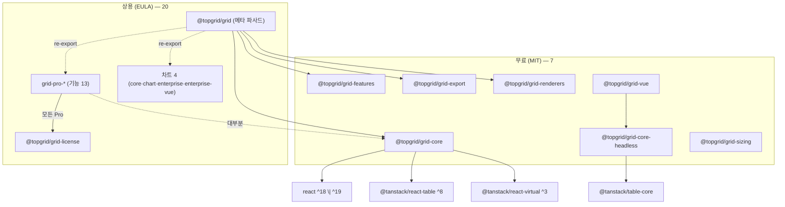

# 아키텍처

topgrid는 **27개 패키지**로 구성된 monorepo 구조입니다 — **무료(MIT) 7 + 상용(EULA) 20**.
React 코어 + Vue 어댑터(멀티프레임워크), Pro 기능, 차트 패밀리로 나뉩니다.

## 패키지 목록

### 무료 (MIT) — 7

| 패키지 | 설명 |
|--------|------|
| `@topgrid/grid-core` | TanStack Table 추상화 wrapper + `useGridState`·`<Grid>`·가상화·페이지네이션·정렬/필터 배선 |
| `@topgrid/grid-core-headless` | 프레임워크 무관 headless 코어(`@tanstack/table-core` 기반) — React/Vue 공유 |
| `@topgrid/grid-renderers` | 셀 렌더러 11종(텍스트·숫자·날짜·배지·링크·버튼·체크·아이콘·태그·아바타·진행률) + 레지스트리 |
| `@topgrid/grid-features` | 필터 UI(text/number/date/set·글로벌·플로팅)·다중 정렬 |
| `@topgrid/grid-sizing` | 컬럼 사이징 — auto-size·size-to-fit·star(비율) 폭 |
| `@topgrid/grid-export` | Excel/CSV/PDF 내보내기·클립보드·인쇄 (`xlsx`·`jspdf` peer) |
| `@topgrid/grid-vue` | Vue 3 어댑터 — headless 코어를 `useVueTable` 로 구동 |

### 상용 (EULA) — 20

**파사드 · 라이선스 (3)**

| 패키지 | 설명 |
|--------|------|
| `@topgrid/grid` | 메타 패키지 — 전체 패키지 re-export 파사드 |
| `@topgrid/grid-license` | 런타임 Pro 라이선스 검증 + Watermark |
| `@topgrid/grid-license-core` | 라이선스 검증 코어(프레임워크 무관) |

**Pro 기능 (13)**

| 패키지 | 설명 |
|--------|------|
| `@topgrid/grid-pro-agg` | 집계/그룹 — 그룹별 합계·평균·카운트, 그룹 footer·패널 |
| `@topgrid/grid-pro-pivot` | 피벗 — 다축 피벗 테이블·소계·전치·피벗 패널(DnD) |
| `@topgrid/grid-pro-serverside` | 서버사이드 행 모델(SSRM) — 블록 lazy 로드·무한 스크롤·뷰포트 모델·서버 트리 |
| `@topgrid/grid-pro-master` | 마스터-디테일·트리·컨텍스트 메뉴 |
| `@topgrid/grid-pro-merging` | 셀 병합 — rowSpan/colSpan |
| `@topgrid/grid-pro-header` | 다중행 헤더·컬럼 그룹 |
| `@topgrid/grid-pro-datamap` | 데이터 매핑 — 코드→라벨(FK 표시), async 맵 |
| `@topgrid/grid-pro-tracking` | 변경 추적 — 편집 행·셀 dirty 상태 |
| `@topgrid/grid-pro-range` | 범위 선택 — 드래그 선택·fill handle·클립보드 복사/붙여넣기 |
| `@topgrid/grid-pro-edit-plus` | 편집 심화 — 검증 룰·undo/redo·find & replace·셀 코멘트 |
| `@topgrid/grid-pro-filter` | 멀티(AND/OR)·어드밴스드(교차 컬럼 식)·크로스 필터 |
| `@topgrid/grid-pro-panel` | 사이드바·툴 패널(컬럼 가시성/순서)·상태바·필터 패널 |
| `@topgrid/grid-pro-sheet` | 스프레드시트 엔진(PoC) — A1 수식·의존 그래프 재계산·셀 서식/스타일/병합 |

**차트 (4)** — 상세는 [차트](./charting)

| 패키지 | 설명 |
|--------|------|
| `@topgrid/grid-chart-core` | 차트 엔진 코어(프레임워크 무관) — 17종 차트 타입 |
| `@topgrid/grid-pro-chart` | 통합 차트·셀 스파크라인 (zero-dep SVG 엔진) |
| `@topgrid/grid-pro-chart-enterprise` | 엔터프라이즈 차트(React) — 17종·다축·BYO·SSR |
| `@topgrid/grid-pro-chart-enterprise-vue` | 엔터프라이즈 차트(Vue) — 동일 엔진·SSR 헬퍼 |

## 의존성 규칙



- **모든 Pro 패키지 → `@topgrid/grid-license`** (런타임 라이선스 게이트).
- **대부분의 Pro → `@topgrid/grid-core`** (`<Grid>` 기반 위 구성).
- 일부 Pro는 **다른 Pro/Open을 합성**한다: `grid-pro-pivot`·`grid-pro-panel` → `grid-pro-agg` · `grid-pro-edit-plus` → `grid-pro-tracking` · `grid-pro-filter` → `grid-features` · `grid-pro-sheet` → `grid-pro-range` · `grid-pro-master` → `grid-export`.
- 내부 의존은 `workspace:*` → 발행 시 정확버전 핀(lockstep). 파사드 `@topgrid/grid`가 전 패키지를 re-export.

## Pro 패키지 라이선스 활성화

Pro 패키지 사용 시 `@topgrid/grid-license`를 통해 런타임 라이선스 검증이 실행됩니다.
앱 진입점에서 라이선스 키를 한 번 설정하세요.

```tsx
import { setLicenseKey } from '@topgrid/grid-license';

setLicenseKey('YOUR-LICENSE-KEY');
```
