# Architecture

topgrid is a monorepo composed of 13 packages.
Packages are classified as Open (MIT) or Pro (commercial license).

## Package List

| Package | Category | Description |
|---------|----------|-------------|
| `@topgrid/grid` | Open (MIT) | Meta package — re-exports all open packages |
| `@topgrid/grid-core` | Open (MIT) | TanStack Table abstraction wrapper + `useGridState` core hook |
| `@topgrid/grid-features` | Open (MIT) | Sort, filter, pagination and other common feature builder options |
| `@topgrid/grid-export` | Open (MIT) | Excel/CSV/PDF export (`xlsx`, `jspdf` peers) |
| `@topgrid/grid-renderers` | Open (MIT) | Cell renderer component library (date, number, badge, etc.) |
| `@topgrid/grid-license` | Open (MIT) | Runtime Pro license validation module |
| `@topgrid/grid-pro-agg` | Pro | Aggregation — group sum, average, count |
| `@topgrid/grid-pro-datamap` | Pro | Data mapping — code-to-label conversion, hierarchical select |
| `@topgrid/grid-pro-header` | Pro | Advanced header — multi-row header merge, fixed header |
| `@topgrid/grid-pro-master` | Pro | Master-Detail — row expansion + nested grid |
| `@topgrid/grid-pro-merging` | Pro | Cell merging — automatic rowSpan/colSpan for equal values |
| `@topgrid/grid-pro-range` | Pro | Range selection — drag cell select, copy, paste |
| `@topgrid/grid-pro-tracking` | Pro | Change tracking — edited row/cell dirty state management |

## Dependency Diagram

```mermaid
graph TD
  subgraph Open["Open (MIT)"]
    grid["@topgrid/grid<br/>(meta)"]
    grid-core["@topgrid/grid-core"]
    grid-features["@topgrid/grid-features"]
    grid-export["@topgrid/grid-export"]
    grid-renderers["@topgrid/grid-renderers"]
    grid-license["@topgrid/grid-license"]
  end

  subgraph Pro["Pro (commercial license)"]
    pro-agg["@topgrid/grid-pro-agg"]
    pro-datamap["@topgrid/grid-pro-datamap"]
    pro-header["@topgrid/grid-pro-header"]
    pro-master["@topgrid/grid-pro-master"]
    pro-merging["@topgrid/grid-pro-merging"]
    pro-range["@topgrid/grid-pro-range"]
    pro-tracking["@topgrid/grid-pro-tracking"]
  end

  subgraph Peers["peer dependencies"]
    react["react ^18"]
    tanstack["@tanstack/react-table ^8"]
    virtual["@tanstack/react-virtual ^3"]
  end

  grid --> grid-core
  grid --> grid-features
  grid --> grid-renderers
  grid-core --> grid-features
  pro-agg --> grid-core
  pro-datamap --> grid-core
  pro-header --> grid-core
  pro-master --> grid-core
  pro-merging --> grid-core
  pro-range --> grid-core
  pro-tracking --> grid-core
  pro-agg --> grid-license
  pro-datamap --> grid-license
  pro-header --> grid-license
  pro-master --> grid-license
  pro-merging --> grid-license
  pro-range --> grid-license
  pro-tracking --> grid-license
  grid-core --> react
  grid-core --> tanstack
  grid-core --> virtual
```



## Directory Structure

```
topgrid/
├── packages/           # Published packages (pnpm publish)
│   ├── grid/           # MIT — meta package
│   ├── grid-core/      # MIT — core hook
│   ├── grid-features/  # MIT — feature builders
│   ├── grid-export/    # MIT — export utilities
│   ├── grid-renderers/ # MIT — cell renderers
│   ├── grid-license/   # MIT — license validation
│   ├── grid-pro-agg/   # Pro — aggregation
│   ├── grid-pro-datamap/  # Pro — data mapping
│   ├── grid-pro-header/   # Pro — advanced header
│   ├── grid-pro-master/   # Pro — master-detail
│   ├── grid-pro-merging/  # Pro — cell merging
│   ├── grid-pro-range/    # Pro — range selection
│   └── grid-pro-tracking/ # Pro — change tracking
└── apps/
    └── docs/           # private — Docusaurus + TypeDoc API documentation site
```

## Pro Package License Activation

When using Pro packages, `@topgrid/grid-license` performs runtime license validation.
Initialize your license key once at the application entry point.

```tsx
import { setLicenseKey } from '@topgrid/grid-license';

setLicenseKey('YOUR-LICENSE-KEY');
```

Without a valid license key, Pro components display a watermark overlay.
Contact [sales@platree.com](mailto:sales@platree.com) to obtain a license key.
