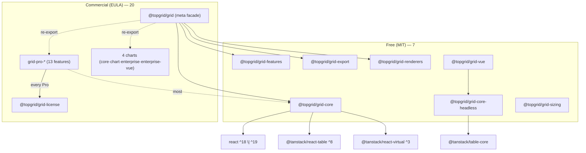

# Architecture

topgrid is a monorepo composed of **27 packages** — **Free (MIT) 7 + Commercial (EULA) 20**.
It is divided into a React core + Vue adapter (multi-framework), Pro features, and a chart family.

## Package List

### Free (MIT) — 7

| Package | Description |
|--------|------|
| `@topgrid/grid-core` | TanStack Table abstraction wrapper + `useGridState`·`<Grid>`·virtualization·pagination·sort/filter wiring |
| `@topgrid/grid-core-headless` | Framework-agnostic headless core (based on `@tanstack/table-core`) — shared by React/Vue |
| `@topgrid/grid-renderers` | 11 cell renderers (text·number·date·badge·link·button·check·icon·tag·avatar·progress) + registry |
| `@topgrid/grid-features` | Filter UI (text/number/date/set·global·floating)·multi-sort |
| `@topgrid/grid-sizing` | Column sizing — auto-size·size-to-fit·star (proportional) widths |
| `@topgrid/grid-export` | Excel/CSV/PDF export·clipboard·print (`xlsx`·`jspdf` peers) |
| `@topgrid/grid-vue` | Vue 3 adapter — drives the headless core via `useVueTable` |

### Commercial (EULA) — 20

**Facade · License (3)**

| Package | Description |
|--------|------|
| `@topgrid/grid` | Meta package — facade re-exporting every package |
| `@topgrid/grid-license` | Runtime Pro license validation + Watermark |
| `@topgrid/grid-license-core` | License validation core (framework-agnostic) |

**Pro Features (13)**

| Package | Description |
|--------|------|
| `@topgrid/grid-pro-agg` | Aggregation/grouping — group sum·average·count, group footer·panel |
| `@topgrid/grid-pro-pivot` | Pivoting — multi-axis pivot table·subtotals·transpose·pivot panel (DnD) |
| `@topgrid/grid-pro-serverside` | Server-side row model (SSRM) — block lazy-load·infinite scroll·viewport model·server-side tree |
| `@topgrid/grid-pro-master` | Master-detail·tree·context menu |
| `@topgrid/grid-pro-merging` | Cell merging — rowSpan/colSpan |
| `@topgrid/grid-pro-header` | Multi-row header·column groups |
| `@topgrid/grid-pro-datamap` | Data mapping — code→label (FK display), async maps |
| `@topgrid/grid-pro-tracking` | Change tracking — dirty row/cell state |
| `@topgrid/grid-pro-range` | Range selection — drag select·fill handle·clipboard copy/paste |
| `@topgrid/grid-pro-edit-plus` | Advanced editing — validation rules·undo/redo·find & replace·cell comments |
| `@topgrid/grid-pro-filter` | Multi (AND/OR)·advanced (cross-column expression)·cross-filter |
| `@topgrid/grid-pro-panel` | Side bar·tool panel (column visibility/order)·status bar·filters panel |
| `@topgrid/grid-pro-sheet` | Spreadsheet engine (PoC) — A1 formulas·dependency-graph recalc·cell format/style/merge |

**Charts (4)** — for details see [Charts](./charting)

| Package | Description |
|--------|------|
| `@topgrid/grid-chart-core` | Chart engine core (framework-agnostic) — 17 chart types |
| `@topgrid/grid-pro-chart` | Integrated charts·cell sparklines (zero-dependency SVG engine) |
| `@topgrid/grid-pro-chart-enterprise` | Enterprise charts (React) — 17 types·multi-axis·BYO·SSR |
| `@topgrid/grid-pro-chart-enterprise-vue` | Enterprise charts (Vue) — same engine·SSR helpers |

## Dependency Rules



- **Every Pro package → `@topgrid/grid-license`** (runtime license gate).
- **Most Pro → `@topgrid/grid-core`** (built on top of `<Grid>`).
- Some Pro packages **compose other Pro/Open packages**: `grid-pro-pivot`·`grid-pro-panel` → `grid-pro-agg` · `grid-pro-edit-plus` → `grid-pro-tracking` · `grid-pro-filter` → `grid-features` · `grid-pro-sheet` → `grid-pro-range` · `grid-pro-master` → `grid-export`.
- Internal dependencies use `workspace:*` → exact-version pins on publish (lockstep). The `@topgrid/grid` facade re-exports every package.

## Pro Package License Activation

When using Pro packages, a runtime license check runs via `@topgrid/grid-license`.
Set your license key once at the app entry point.

```tsx
import { setLicenseKey } from '@topgrid/grid-license';

setLicenseKey('YOUR-LICENSE-KEY');
```
